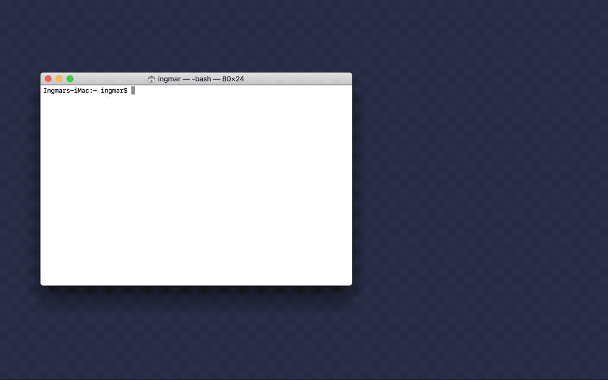

# ssh-select



## Installation

### Download

Download the latest version from the [releases](https://github.com/iwittkau/ssh-select/releases) page.

### Build from source

***Requires Go***

Latest version (master should be stable)

```bash
go get github.com/iwittkau/ssh-select/cmd/sshs@master
```

Latest release

```bash
go get github.com/iwittkau/ssh-select/cmd/sshs@latest
```

## Setup

```bash
sshs --init
```

Edit your configuration file `~/.sshs-config`.

### Configuration Example

```yml
system: macos
stayopen: true
servers:
- name: raspi-3
  ipaddress: 10.0.0.4
  username: pi
  profile: Homebrew
- name: NAS
  ipaddress: nas.local
  username: nas-admin
  profile: Pro
  port: 2222
```

#### General Options

`system` - name of the system you use. Supported systems so far:
* `macos` for macOS standard terminals
* `gnome` for GNOME terminals on linux
* `iterm` for iTerm terminals on macOS
* `tmux` for tmux terminals on multiple platforms
* `putty` for PuTTY terminals on Windows   

`stayopen` - leave `sshs` open after a server selection: `true` or `false`

#### Connection Options

`name` - name of the connection  
`ipaddress` - the IP address to connect to  
`username` -  the username  
`profile` - name of the Terminal.app, Gnome Terminal or iTerm profile
`port` - set a non-default port


## Usage

```bash
sshs [index]
```

`index` optional number, directly sets up a connection with the corresponding index of your configuration file (also shown in the "ui").

